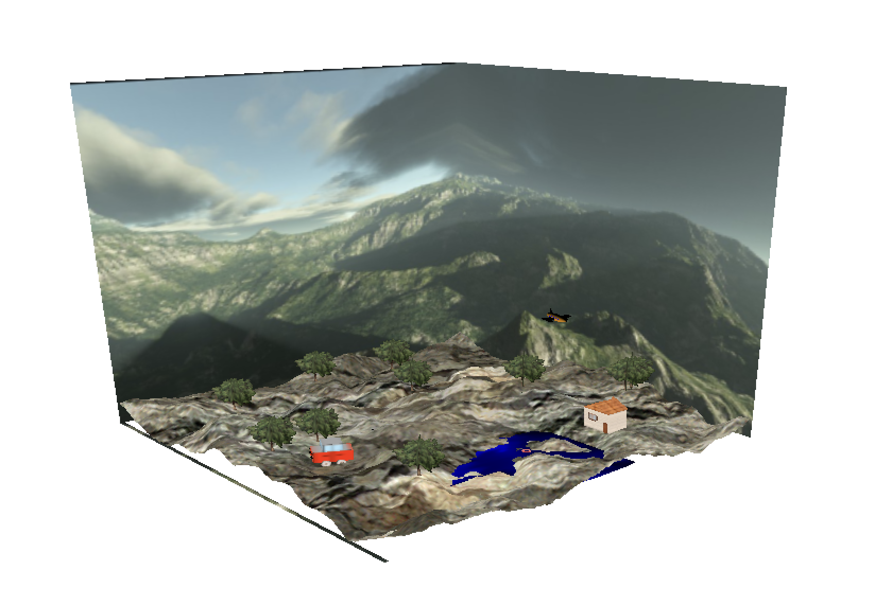

# 3D Graphics Environment

University project developed in C++ using gKit.

### Global scene

## Demo Video

[▶️ Watch Demo Video](https://rb.gy/vhmy25)

## Description

This project explores 3D computer graphics concepts through the creation of a complete 3D scene.

## Features

- Procedural generation of 3D shapes: cylinder, cone, sphere, disk, torus
- Texture mapping and UV coordinates
- Geometric transformations: translation, rotation, scale
- Terrain generation from a heightmap
- Billboard trees
- Cubemap / skybox
- Animated objects such as a car and an airplane

## Technologies

- C++
- gKit 
